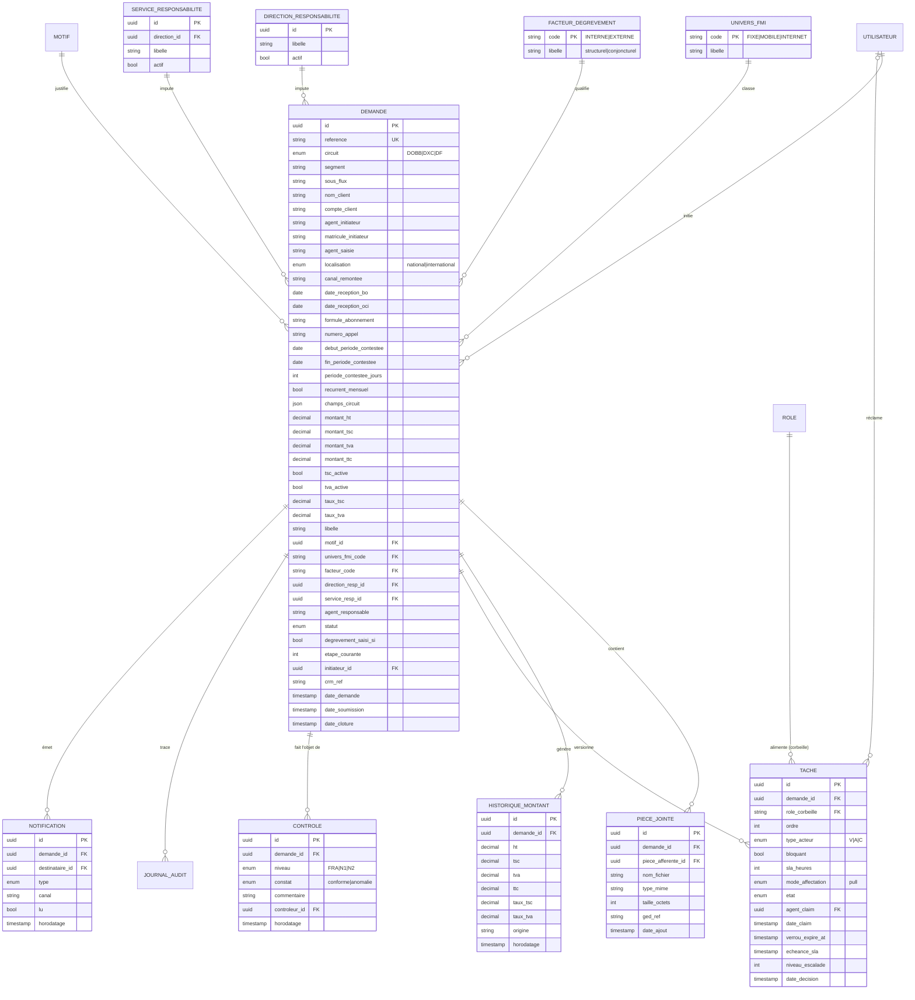
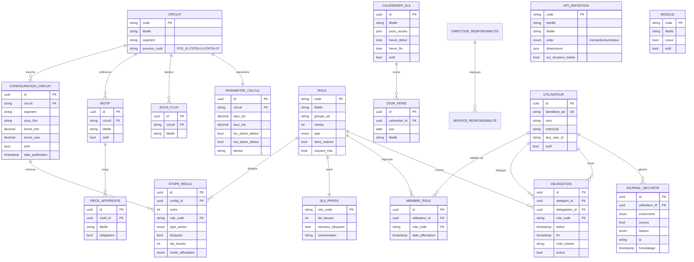

/
Claude a terminé la réponse.
Bonne remontée — c'est le bon moment pour la faire. Je vérifie ce que disent réellement les sources avant de trancher.


Chercher délégation
Chercher délégation
Le tableau est clair. Vérifions les deux autres points dans les sources v1.1.


Délégation dans le MLD v1.1
Délégation dans le MLD v1.1
La question 1 est tranchée par la source : le v1.1 porte bien delegant_id. Vérifions les points 2 et 3.


Exécuté 2 commandes
Exécuté 2 commandes
La source ne définit nulle part l'expansion de V/A/C. Vérifions le dernier point.


Usage de localisation
Usage de localisation
Les trois points ont maintenant des réponses fondées sur les sources. Deux sont tranchés, un seul reste ouvert.

1. Delegation — non, ajoutez delegantId. Ce n'est pas un choix : le MLD v1.1 source (04_MCD_MLD_PGD_PROD.md) porte bien les trois champs delegant_id, delegataire_id, role_code, plus debut, fin, note_interim, active, avec deux relations distinctes UTILISATEUR ||--o{ DELEGATION (« délègue » / « reçoit »). Votre reconstruction a perdu le délégant.

C'est structurant, pas cosmétique. Sans delegantId :

Le SoD devient faux. SodGuard vérifie qu'aucune action de l'agent courant n'existe sur l'étape N-1. Si un délégataire agit à la place d'un titulaire qui, lui, a déjà agi en amont, l'interdiction doit remonter au délégant. Sans lui, la vérification est aveugle.
La non-répudiation tombe. Le scénario de recette R12 exige que l'action soit « tracée avec mention de la délégation » — c'est-à-dire X a agi au nom de Y. Sans delegantId, vous ne pouvez pas reconstituer au nom de qui.
Vous ne pouvez pas détecter deux délégations concurrentes du même titulaire sur le même rôle.
2. V/A/C — n'expansez pas, et surtout ne devinez pas. La source pose l'énumération sans jamais gloser les lettres. Votre lecture est plausible mais A est ambigu : Approbateur ou Avis ? Et V peut être Validateur ou Visa. Le risque est de figer un contresens dans le schéma, les seeds et l'UI.

Gardez les codes V/A/C comme valeurs d'énumération — c'est ce que fait la source — et portez le libellé lisible dans un champ dédié ou une table de libellés, alimenté par les seeds. L'expansion devient une donnée corrigeable sans migration. J'inscris la question au registre des points à confirmer par le métier ; Aroun KONÉ ou le référent processus tranchera.

3. localisation — gardez-la, mais sur le bon périmètre. Elle est documentée : c'est un champ de la fiche DOBB (B2B) — « localisation (National/International) » — et non un attribut universel. Elle n'intervient nulle part dans le routage : aucune règle pivot ne s'en sert. C'est une dimension de saisie et d'analyse, pas de décision.

Donc : conservez-la sur DEMANDE en nullable, sans usage dans le moteur de règles, et rendez-la obligatoire uniquement côté formulaire DOBB. La retirer coûterait une migration plus tard ; la laisser nullable ne coûte rien.

Je répercute ces trois points dans les livrables.


Exécuté 2 commandes
Exécuté 2 commandes
Maintenant j'ajoute au modèle de données la section qui manquait : le détail explicite des entités v1.1 sur ces trois points.


Exécuté 3 commandes
Exécuté 3 commandes
Ajoutons l'invariant SoD sous délégation, qui découle du point 1.


Exécuté 4 commandes
Exécuté 4 commandes
Ajoutons le test de non-régression correspondant, puis la story de délégation.


Exécuté 4 commandes, lu un fichier
Exécuté 4 commandes, lu un fichier
Réponses aux trois points, toutes fondées sur les sources — et une nouvelle section §4bis dans 03_Modele_Donnees_v2.md qui comble précisément le manque que vous avez identifié.

1. Delegation : ajoutez delegantId. Le MLD v1.1 source le porte déjà — votre reconstruction l'a perdu. Schéma complet fourni en §4bis.1, avec debut, fin, note_interim, active et deux contraintes CHECK. Côté Prisma : deux relations nommées vers Utilisateur.

C'est structurant, pas cosmétique. Sans le délégant, le SoD est contournable : un titulaire ayant traité l'étape N-1 peut valider l'étape N via son intérimaire, sans trace. J'ai donc ajouté R21 (SoD vérifié contre délégataire et délégant) et R22 (pas deux délégations actives recouvrantes sur le même couple), plus le volet correspondant dans le test critique T2 et dans la story PGD-058 (relevée à 8 pts).

2. V/A/C : ne devinez pas. Les sources posent les trois codes sans jamais les gloser. A est ambigu — Approbateur ou Avis ? — et V aussi — Validateur ou Visa ? Stockez les codes tels quels, portez le libellé lisible en seed : une correction devient une mise à jour de donnée, pas une migration d'énumération. Question inscrite au registre de la charte et de CLAUDE.md.

3. localisation : gardez-la, hors routage. Elle est documentée comme champ de la fiche DOBB uniquement. Aucune règle pivot ne s'en sert — c'est une dimension de saisie et d'analyse, pas de décision. Donc : nullable sur DEMANDE, obligatoire côté formulaire DOBB seulement, jamais introduite dans le moteur de règles. La retirer coûterait une migration ; la garder ne coûte rien.

Backlog : 58 stories / 363 points.

Feu vert sur votre séquence — package.json / pnpm-workspace.yaml / turbo.json, puis packages/config, bootstrap apps/api, docker-compose.yml. Deux rappels pour cette phase : le compose inclut rabbitmq:3-management (D2 révisée), et packages/contracts ne dépend de rien d'autre que Zod.

Une dernière remarque sur votre méthode : la reconstruction par recoupement était le bon réflexe, mais 04_MCD_MLD_PGD_PROD.md est dans le dépôt et contient le détail SQL complet des entités v1.1. Lisez-le directement plutôt que de l'inférer — c'est ce qui a fait perdre delegant_id.


03 modele donnees v2
Document · MD 

Claude
Document · MD 

04 userstories realisation
Document · MD 

07 strategie tests recette
Document · MD 

00 charte projet consolidee
Document · MD 
produis le prompt pour Claude Code

J'assemble le prompt de reprise à partir de l'état réel des documents.


Détail phase 1 et règles
Détail phase 1 et règles
Le prompt tient compte du fait que Claude Code a déjà lu les documents et attend votre validation.


Fichier créé, a exécuté une commande, lu un fichier
Fichier créé, a exécuté une commande, lu un fichier
Le bloc à coller est délimité dans le fichier — tout ce qui est entre les balises de code.

Ce qu'il contient, dans l'ordre : les trois réponses argumentées (avec le SQL de DELEGATION pour éviter une nouvelle reconstruction), la remarque de méthode, puis le périmètre exact de la Phase 1.

Trois consignes valent d'être signalées, parce qu'elles conditionnent la suite :

Le prompt demande à Claude Code de relire docs/03 §4bis et CLAUDE.md avant de coder — les documents ont changé depuis sa lecture initiale, notamment R21/R22 et la révision RabbitMQ. Sans cela il travaillerait sur une version périmée du contexte.

Il exige aussi, en point (c), la liste des entités v1.1 vérifiées contre la source avec les écarts signalés. C'est le vrai correctif au problème de fond : delegant_id a été perdu par inférence, et rien ne garantit que ce soit le seul champ manquant sur les douze entités reconstruites. Mieux vaut le découvrir maintenant qu'en phase 6.

Enfin, packages/config doit inclure les variables AMQP dès 1.2, puisque D2 a été révisée après la rédaction du plan initial.

Le tableau final rappelle trois points à ressortir plus tard : l'ordre impératif de la phase 6, le volet délégation du test T2, et l'export de la maquette avant l'étape 9.0.


Prompt reprise phase1
Document · MD 
Screenshot 2026-07-20 114711.png
message de claude code

Option 1, sans hésitation. Le fichier existe déjà et doit de toute façon être dans le dépôt.

Pourquoi pas l'option 2 — le §5 MLD fait plusieurs centaines de lignes de SQL. Le coller dans le chat le fait consommer du contexte à chaque tour de la session, et surtout il n'est alors versionné nulle part : le prochain développeur, ou Claude Code dans une session ultérieure, ne l'aura plus. C'est exactement le raisonnement qui nous a fait préférer le zip au MCP pour la maquette.

L'option 3 est à écarter. Vous l'avez formulée vous-même : « avec le risque qu'un autre delegant_id se cache dedans ». Douze entités reconstruites par inférence, dont une a déjà perdu un champ structurant — figer ça dans une migration initiale, c'est se garantir des correctifs de schéma en phase 6, quand Tache, JournalAudit et EtapeRegle porteront le claim, le SoD et le moteur de règles.

Le fichier est le socle de tout : schema.prisma en dépend, et tout le reste dépend de schema.prisma.

Réponse à donner :

Option 1. Je copie 04_MCD_MLD_PGD_PROD.md dans docs/ du dépôt.

Vérifie chaque entité contre le §5 (MLD) de ce fichier, et présente-moi un tableau à trois colonnes : entité · statut (conforme / écart / absente de ma reconstruction) · détail de l'écart. Signale en particulier les colonnes manquantes, les FK oubliées, les contraintes CHECK et les index. Ne corrige pas silencieusement — je veux voir la liste avant que tu figes le schéma.

Note que ce fichier est en v1.1 : les extensions v2.0 (nouvelles tables LIGNE, FORMULE, DEMANDE_LIGNE, COMPTE_CLIENT, PARAMETRE_GLOBAL, colonnes si_*, R21/R22 sur DELEGATION) sont dans docs/03_Modele_Donnees_v2.md et priment en cas de divergence.

Ce dernier paragraphe compte : sans lui, Claude Code risque de traiter le v1.1 comme la référence absolue et de rejeter les extensions v2.0 comme des écarts.

Où le placer — docs/04_MCD_MLD_PGD_PROD.md, à côté des autres livrables. Voulez-vous que je l'ajoute au lot de sortie et que je l'inscrive dans l'ordre de lecture du PROMPT_CLAUDE_CODE.md ?


Vous avez utilisé 90 % de votre limite de session.
Obtenir plus d'utilisation


Claude est une IA et peut faire des erreurs. Veuillez vérifier les réponses.
Artéfacts

06 contrats api
Document · MD 

01 prd consolide
Document · MD 

07 strategie tests recette
Document · MD 

05 plan implementation
Document · MD 

03 modele donnees v2
Document · MD 

02 architecture monorepo
Document · MD 

04 userstories realisation
Document · MD 

00 charte projet consolidee
Document · MD 

Prompt reprise phase1
Document · MD 

Prompt claude code
Document · MD 

Claude
Document · MD 
Contenu du projet
Projet Plateforme Gestion Dégrèvement OCI
Créé par vous

04_MCD_MLD_PGD_PROD.md
807 lignes

md


03_UserStories_Backend_NestJS.md
243 lignes

md


02_Architecture_Backend_NestJS.md
337 lignes

md

Contenu
architecture technique.jpeg

PS_AUTOMATISATION PROCESSUS DEGREVEMENT.pptx
pptx

Screenshot 2026-07-20 105101.png
Screenshot 2026-07-20 114711.png

01_Project_Brief.md
79 lignes

md


02_Product_Backlog.md
100 lignes

md


03_PRD.md
175 lignes

md

04_MCD_MLD_PGD_PROD.md


# Modèle de Données — MCD & MLD PGD (Production)
 
> **Méthode BMAD (Build More Architect Dreams)** — Livrable complémentaire : Modèle de données
> **Client :** Orange Côte d'Ivoire — DSI / AIP — Études & Ingénierie IT
> **Projet :** PGD — Plateforme de Gestion des Dégrèvements
> **Stack cible :** NestJS · Prisma · PostgreSQL · Redis (cache + verrous + BullMQ) · Active Directory (LDAP) · MFA Cisco DUO
> **Version :** 1.1 · **Date :** Juin 2026
> **Architecte SI :** Aroun KONÉ
>
> **Sources intégrées en v1.1 :** `WF de validation actes de gestion.xlsx` (SLA & KPI), `FORMULAIRE_DOBB.xlsx` (PO2_B-17), `FORMULAIRE_DXC.xlsx` (PO5-G-07), `FORMULAIRE_DF.doc` (PO6-07)
 
---
 
## 1. Objet et portée
 
Ce document spécifie le **Modèle Conceptuel de Données (MCD)** et le **Modèle Logique de Données (MLD)** de la PGD pour la cible de **production**. Il couvre l'intégralité des exigences fonctionnelles validées : workflow multi-circuits (DOBB/DXC/DF), moteur de règles externalisé au format pivot, corbeilles partagées avec claim/unclaim atomique, séparation des tâches (SoD), RBAC sur catalogue de rôles unifié, MFA DUO pour rôles sensibles, SLA en heures ouvrées avec escalade, délégation tracée, contrôle a posteriori, notifications, KPI, et journalisation non répudiable.
 
La **v1.1** intègre les éléments concrets des quatre fichiers métier : la table des **SLA par profil** et le **référentiel KPI** issus du workflow de validation, et les **champs réels des fiches d'ajustement** des trois circuits, incluant les dimensions analytiques nécessaires aux KPI (univers FMI, facteur de dégrèvement, responsabilité direction/service, période contestée).
 
Le MLD est directement projetable en `schema.prisma` (PostgreSQL source de vérité). Redis n'apparaît pas dans le modèle persistant : il héberge le cache de configuration, les verrous de claim (`SET NX`) et les files BullMQ, reflets volatils reconstructibles depuis PostgreSQL.
 
---
 
## 2. Périmètre couvert vs reporté
 
| Couvert (PROD) | Reporté (industrialisation) |
|---|---|
| Demandes, montants, pièces, historique, dimensions analytiques | Reprise de données / archivage légal détaillé |
| Tâches, corbeilles, verrous, escalade, SLA heures ouvrées | Ajustement en masse multi-lignes (table cadrée, non peuplée) |
| Configuration circuits pivot, étapes-règle, motifs, sous-flux, pièces afférentes | Connecteurs BI externes |
| Rôles, membres, délégation (note d'intérim) | Signature électronique qualifiée |
| Référentiels analytiques (univers FMI, facteur, direction/service) | — |
| Référentiel SLA par profil, référentiel KPI | — |
| Journal d'audit, journal de sécurité, notifications, contrôle a posteriori | — |
 
AD et DUO **réels** dès cette phase ; CRM/GED/SMTP en bouchons, mais références persistées (`ged_ref`, `crm_ref`, journal des notifications).
 
---
 
## 3. Apports des fichiers métier (synthèse)
 
### 3.1 SLA par profil (sheet « SLA »)
 
Décompte en **heures ouvrées** (calendrier métier). Valeurs relevées :
 
| Profil | Acte de gestion principal | SLA |
|---|---|---|
| Initiateur | Création dossier, fiche dégrèvement, pièces, affectation N2, annulation doublon, commentaire clôture, publipostage, rappel, archivage | Vue JADE (pas de minuteur bloquant) |
| Responsable | Réception, pièces, commentaire, validation, faire suivre, rejet, renvoi, extraction bilan mensuel | **8 h** |
| Manager | Réception, pièces, commentaire, validation, faire suivre, rejet, renvoi | **8 h** |
| Manager Senior | Idem Manager | **8 h** |
| DOBB | Réception, pièces, commentaire, validation, faire suivre, rejet, renvoi | **24 h** |
| FRA | Réception, pièces, commentaire, faire suivre au DF, rejet, renvoi | **48 h** |
| DF | Réception, pièces, commentaire, validation, faire suivre, annulation, renvoi | **24 h** |
| DGA/DG | Réception, pièces, commentaire, validation, rejet, renvoi | **24 h** |
| Fiabilisation / Contrôle | Réception, pièces, commentaire, valide/invalide contrôle, renvoi | **10 jours** |
 
Ces valeurs alimentent l'entité **`SLA_PROFIL`** et la colonne `sla_heures` des `ETAPE_REGLE`. Le catalogue d'actes par profil cadre le RBAC (`ROLE`), ce n'est pas une donnée transactionnelle.
 
### 3.2 Référentiel KPI (sheet « KPI'S »)
 
Les ~24 indicateurs se structurent en **familles** avec des **dimensions** récurrentes : montant **HT/TTC**, **volume**, **taux d'évolution M-1 → M**, **univers FMI** (Fixe/Mobile/Internet), **motif**, **facteur de dégrèvement** (interne/structurel vs externe/conjoncturel), **direction** et **service** de responsabilité.
 
| Famille KPI | Indicateurs |
|---|---|
| Dossiers reçus | Montant total (HT/TTC), volume, taux d'évolution, montant/volume par univers, taux d'évolution par univers |
| Dossiers traités (dégrèvement saisi dans le SI) | Montant total (HT/TTC), volume, taux d'évolution, montant/volume par univers, taux d'évolution par univers |
| Top motif | Top global, montant HT/TTC par motif, top par univers, taux motif/global, taux motif/univers |
| Facteurs de dégrèvement | Montant par facteur (interne/externe), taux par facteur |
| Top responsabilité Direction | Montant par direction, taux par direction |
| Top responsabilité Service | Montant par service, taux par service |
 
Définitions portées par **`KPI_DEFINITION`** ; **valeurs** calculées par agrégation sur `DEMANDE`/`HISTORIQUE_MONTANT`, mises en cache Redis (TTL court). Les dimensions exigent les colonnes analytiques de `DEMANDE` et la distinction **reçu vs traité** (`degrevement_saisi_si`).
 
### 3.3 Champs des fiches d'ajustement
 
**DOBB (PO2_B-17 — B2B)** : date réception BO, date saisie, agent initiateur, agent de saisie, localisation (National/International), canal de remontée (point de contact), date réception OCI, nom/compte client, formule d'abonnement, n° d'appel, début/fin/durée (jours) période contestée, récurrent mensuel, HT, TSC 3 %, TVA, TTC, **responsabilité** (direction/service/agent), motif (+ pièce afférente), commentaires.
 
**DXC (PO5-G-07 — B2C)** : réf saisie, date demande, date saisie, agent initiateur + matricule, agent de saisie, nom/compte client, formule Internet, récurrent mensuel, montant total à ajuster, HT, TSC 3 %, TVA 18 %, libellé, motif, commentaire.
 
**DF (PO6-07 — Opérateurs Wholesale)** : circuit par tranche (≤ 5 M / 5 M–50 M / > 50 M), mémo descriptif, pièces justificatives multiples (fiche de calcul, preuves incident, courrier réclamation, factures, contrat/bon de commande, CDR, extractions ASP Interco, price list), contrôle **FRA obligatoire au-delà de 5 M FCFA**, **note d'intérim** en cas d'indisponibilité d'un validateur, Credit note signée DFA puis DF.
 
Champs **communs** → colonnes de `DEMANDE`. Champs **propres au circuit** → `champs_circuit` (JSONB), sauf dimensions KPI **promues en colonnes** (univers, facteur, responsabilité). Listes (motifs, pièces, directions, services) → référentiels.
 
---
 
## 4. Modèle Conceptuel de Données (MCD)
 
### 4.1 Sous-domaines
 
1. **Métier** : `DEMANDE`, `PIECE_JOINTE`, `HISTORIQUE_MONTANT`, `TACHE`, `CONTROLE`, `NOTIFICATION`.
2. **Configuration** : `CIRCUIT`, `CONFIGURATION_CIRCUIT`, `ETAPE_REGLE`, `MOTIF`, `PIECE_AFFERENTE`, `SOUS_FLUX`, `PARAMETRE_CALCUL`, `CALENDRIER_SLA`, `JOUR_FERIE`, `MODULE`, `SLA_PROFIL`.
3. **Référentiels analytiques (KPI)** : `UNIVERS_FMI`, `FACTEUR_DEGREVEMENT`, `DIRECTION_RESPONSABILITE`, `SERVICE_RESPONSABILITE`, `KPI_DEFINITION`.
4. **Identité & sécurité** : `UTILISATEUR`, `ROLE`, `MEMBRE_ROLE`, `DELEGATION`, `JOURNAL_AUDIT`, `JOURNAL_SECURITE`.
### 4.2 MCD — domaine métier & analytique
 

 
### 4.3 MCD — configuration & sécurité
 

 
### 4.4 Cardinalités structurantes
 
| Association | Cardinalité | Règle métier |
|---|---|---|
| DEMANDE → TACHE | 1,1 — 0,N | Chaîne instanciée à la soumission |
| ROLE → TACHE (corbeille) | 1,1 — 0,N | Affectation pull, jamais nominative |
| UTILISATEUR → TACHE (claim) | 0,1 — 0,N | Tâche réclamée tenue par au plus un agent |
| CONFIGURATION_CIRCUIT → ETAPE_REGLE | 1,1 — 1,N | Une tranche pivot ordonne une chaîne |
| MOTIF → PIECE_AFFERENTE | 1,1 — 0,N | Pièces exigées selon le motif (DOBB/DF) |
| ROLE → SLA_PROFIL | 1,1 — 1,1 | SLA de référence par profil |
| UNIVERS_FMI → DEMANDE | 1,1 — 0,N | Fixe/Mobile/Internet (KPI) |
| FACTEUR_DEGREVEMENT → DEMANDE | 1,1 — 0,N | Interne vs externe (KPI) |
| DIRECTION/SERVICE_RESPONSABILITE → DEMANDE | 1,1 — 0,N | Top responsabilité (KPI) |
| DELEGATION (délégant/délégataire) | 2 rôles d'UTILISATEUR | Note d'intérim conservée (PO6-07) |
 
---
 
## 5. Modèle Logique de Données (MLD)
 
### 5.1 Conventions
 
PK `uuid` (v4) ; référentiels stables à clé naturelle (`ROLE.code`, `CIRCUIT.code`, `UNIVERS_FMI.code`, `FACTEUR_DEGREVEMENT.code`, `KPI_DEFINITION.code`, `MODULE.code`, `SLA_PROFIL.role_code`). Horodatages `timestamptz` (UTC) ; montants `numeric(15,2)` (plancher 0) ; taux `numeric(5,4)`. Énumérations `ENUM`. Journaux **append-only**.
 
### 5.2 Domaine métier (tables enrichies)
 
```
DEMANDE(
  id UUID PK,
  reference VARCHAR(40) UNIQUE NOT NULL,
  circuit ENUM_CIRCUIT NOT NULL,
  segment VARCHAR(20) NOT NULL,
  sous_flux VARCHAR(60),
  -- identité client / acteurs (commun aux 3 fiches)
  nom_client VARCHAR(160) NOT NULL,
  compte_client VARCHAR(60),
  agent_initiateur VARCHAR(120),
  matricule_initiateur VARCHAR(40),
  agent_saisie VARCHAR(120),
  -- contexte (DOBB principalement)
  localisation ENUM_LOCALISATION,
  canal_remontee VARCHAR(80),
  date_reception_bo DATE,
  date_reception_oci DATE,
  formule_abonnement VARCHAR(120),
  numero_appel VARCHAR(40),
  debut_periode_contestee DATE,
  fin_periode_contestee DATE,
  periode_contestee_jours INT,
  recurrent_mensuel BOOLEAN DEFAULT FALSE,
  -- champs propres au circuit non promus
  champs_circuit JSONB NOT NULL DEFAULT '{}',
  -- montants
  montant_ht NUMERIC(15,2) NOT NULL CHECK (montant_ht >= 0),
  montant_tsc NUMERIC(15,2) NOT NULL DEFAULT 0,
  montant_tva NUMERIC(15,2) NOT NULL DEFAULT 0,
  montant_ttc NUMERIC(15,2) NOT NULL DEFAULT 0,
  tsc_active BOOLEAN NOT NULL DEFAULT TRUE,
  tva_active BOOLEAN NOT NULL DEFAULT TRUE,
  taux_tsc NUMERIC(5,4) NOT NULL DEFAULT 0.0300,
  taux_tva NUMERIC(5,4) NOT NULL DEFAULT 0.1800,
  libelle VARCHAR(255),
  -- qualification (motif + dimensions KPI)
  motif_id UUID FK -> MOTIF(id),
  univers_fmi_code VARCHAR(10) FK -> UNIVERS_FMI(code),
  facteur_code VARCHAR(10) FK -> FACTEUR_DEGREVEMENT(code),
  direction_resp_id UUID FK -> DIRECTION_RESPONSABILITE(id),
  service_resp_id UUID FK -> SERVICE_RESPONSABILITE(id),
  agent_responsable VARCHAR(120),
  -- cycle de vie
  statut ENUM_STATUT NOT NULL DEFAULT 'brouillon',
  degrevement_saisi_si BOOLEAN NOT NULL DEFAULT FALSE,
  etape_courante INT NOT NULL DEFAULT 0,
  initiateur_id UUID NOT NULL FK -> UTILISATEUR(id),
  crm_ref VARCHAR(60),
  date_demande TIMESTAMPTZ NOT NULL DEFAULT now(),
  date_soumission TIMESTAMPTZ,
  date_cloture TIMESTAMPTZ
)
  INDEX idx_demande_statut (statut),
  INDEX idx_demande_circuit_segment (circuit, segment),
  INDEX idx_demande_initiateur (initiateur_id),
  INDEX idx_demande_kpi (univers_fmi_code, facteur_code, degrevement_saisi_si, date_cloture),
  INDEX idx_demande_motif (motif_id),
  INDEX idx_demande_resp (direction_resp_id, service_resp_id)
 
PIECE_JOINTE(
  id UUID PK,
  demande_id UUID NOT NULL FK -> DEMANDE(id) ON DELETE CASCADE,
  piece_afferente_id UUID FK -> PIECE_AFFERENTE(id),   -- type de pièce attendu
  nom_fichier VARCHAR(255) NOT NULL,
  type_mime VARCHAR(120) NOT NULL,
  taille_octets INT NOT NULL,
  ged_ref VARCHAR(120),
  date_ajout TIMESTAMPTZ NOT NULL DEFAULT now()
)
  INDEX idx_piece_demande (demande_id)
 
HISTORIQUE_MONTANT(
  id UUID PK,
  demande_id UUID NOT NULL FK -> DEMANDE(id) ON DELETE CASCADE,
  ht NUMERIC(15,2) NOT NULL, tsc NUMERIC(15,2) NOT NULL,
  tva NUMERIC(15,2) NOT NULL, ttc NUMERIC(15,2) NOT NULL,
  taux_tsc NUMERIC(5,4) NOT NULL, taux_tva NUMERIC(5,4) NOT NULL,
  origine ENUM_ORIGINE NOT NULL,
  horodatage TIMESTAMPTZ NOT NULL DEFAULT now()
)
  INDEX idx_histo_demande (demande_id, horodatage)
 
TACHE(
  id UUID PK,
  demande_id UUID NOT NULL FK -> DEMANDE(id) ON DELETE CASCADE,
  role_corbeille VARCHAR(40) NOT NULL FK -> ROLE(code),
  ordre INT NOT NULL,
  type_acteur ENUM_TYPE_ACTEUR NOT NULL,
  bloquant BOOLEAN NOT NULL,
  sla_heures INT NOT NULL,
  mode_affectation ENUM_AFFECTATION NOT NULL DEFAULT 'pull',
  etat ENUM_ETAT_TACHE NOT NULL DEFAULT 'EN_ATTENTE',
  agent_claim UUID FK -> UTILISATEUR(id),
  date_claim TIMESTAMPTZ, verrou_expire_at TIMESTAMPTZ,
  echeance_sla TIMESTAMPTZ, niveau_escalade INT NOT NULL DEFAULT 0,
  date_decision TIMESTAMPTZ
)
  INDEX idx_tache_corbeille (role_corbeille, etat),
  INDEX idx_tache_demande_ordre (demande_id, ordre),
  INDEX idx_tache_sla (etat, echeance_sla),
  INDEX idx_tache_verrou (etat, verrou_expire_at)
 
CONTROLE(
  id UUID PK,
  demande_id UUID NOT NULL FK -> DEMANDE(id) ON DELETE CASCADE,
  niveau ENUM_NIVEAU_CTRL NOT NULL,            -- FRA | N1 | N2
  constat ENUM_CONSTAT NOT NULL,
  commentaire TEXT,
  controleur_id UUID NOT NULL FK -> UTILISATEUR(id),
  horodatage TIMESTAMPTZ NOT NULL DEFAULT now()
)
  INDEX idx_controle_demande (demande_id)
 
NOTIFICATION(
  id UUID PK,
  demande_id UUID FK -> DEMANDE(id) ON DELETE CASCADE,
  destinataire_id UUID NOT NULL FK -> UTILISATEUR(id),
  type ENUM_TYPE_NOTIF NOT NULL,
  canal VARCHAR(10) NOT NULL DEFAULT 'in_app',
  lu BOOLEAN NOT NULL DEFAULT FALSE,
  horodatage TIMESTAMPTZ NOT NULL DEFAULT now()
)
  INDEX idx_notif_destinataire (destinataire_id, lu)
```
 
### 5.3 Référentiels analytiques (nouveaux — KPI)
 
```
UNIVERS_FMI(
  code VARCHAR(10) PK,                 -- FIXE | MOBILE | INTERNET
  libelle VARCHAR(40) NOT NULL
)
 
FACTEUR_DEGREVEMENT(
  code VARCHAR(10) PK,                 -- INTERNE | EXTERNE
  libelle VARCHAR(60) NOT NULL         -- structurel | conjoncturel
)
 
DIRECTION_RESPONSABILITE(
  id UUID PK,
  libelle VARCHAR(120) NOT NULL UNIQUE,
  actif BOOLEAN NOT NULL DEFAULT TRUE
)
 
SERVICE_RESPONSABILITE(
  id UUID PK,
  direction_id UUID FK -> DIRECTION_RESPONSABILITE(id),
  libelle VARCHAR(120) NOT NULL,
  actif BOOLEAN NOT NULL DEFAULT TRUE,
  UNIQUE (direction_id, libelle)
)
 
KPI_DEFINITION(
  code VARCHAR(60) PK,
  famille VARCHAR(60) NOT NULL,        -- recus | traites | top_motif | facteurs | resp_direction | resp_service
  libelle VARCHAR(160) NOT NULL,
  unite ENUM_UNITE_KPI NOT NULL,       -- montant | volume | taux
  dimensions JSONB NOT NULL DEFAULT '[]',  -- ['univers','motif','facteur','direction','service','htttc','evolution_m']
  sur_dossiers_traites BOOLEAN NOT NULL DEFAULT FALSE
)
```
 
### 5.4 Configuration (enrichie)
 
```
CIRCUIT(
  code VARCHAR(10) PK,                 -- DOBB | DXC | DF
  libelle VARCHAR(80) NOT NULL,
  segment VARCHAR(20) NOT NULL,
  process_code VARCHAR(20)             -- PO2_B-17 | PO5-G-07 | PO6-07
)
 
CONFIGURATION_CIRCUIT(
  id UUID PK,
  circuit VARCHAR(10) NOT NULL FK -> CIRCUIT(code),
  segment VARCHAR(20) NOT NULL,
  sous_flux VARCHAR(60),
  borne_min NUMERIC(15,2) NOT NULL DEFAULT 0,
  borne_max NUMERIC(15,2) NOT NULL,
  actif BOOLEAN NOT NULL DEFAULT TRUE,
  date_publication TIMESTAMPTZ NOT NULL DEFAULT now(),
  CHECK (borne_min < borne_max),
  EXCLUDE USING gist (
    circuit WITH =, segment WITH =, coalesce(sous_flux,'') WITH =,
    numrange(borne_min, borne_max, '[]') WITH &&
  ) WHERE (actif)
)
  INDEX idx_config_routage (circuit, segment, sous_flux, actif)
 
ETAPE_REGLE(
  id UUID PK,
  config_id UUID NOT NULL FK -> CONFIGURATION_CIRCUIT(id) ON DELETE CASCADE,
  ordre INT NOT NULL,
  role_code VARCHAR(40) NOT NULL FK -> ROLE(code),
  type_acteur ENUM_TYPE_ACTEUR NOT NULL,
  bloquant BOOLEAN NOT NULL,
  sla_heures INT NOT NULL,
  mode_affectation ENUM_AFFECTATION NOT NULL DEFAULT 'pull',
  UNIQUE (config_id, ordre)
)
 
MOTIF(
  id UUID PK,
  circuit VARCHAR(10) NOT NULL FK -> CIRCUIT(code),
  libelle VARCHAR(120) NOT NULL,
  actif BOOLEAN NOT NULL DEFAULT TRUE,
  UNIQUE (circuit, libelle)
)
 
PIECE_AFFERENTE(                       -- pièces attendues par motif (DOBB / DF)
  id UUID PK,
  motif_id UUID NOT NULL FK -> MOTIF(id) ON DELETE CASCADE,
  libelle VARCHAR(120) NOT NULL,
  obligatoire BOOLEAN NOT NULL DEFAULT FALSE
)
 
SOUS_FLUX(
  id UUID PK,
  circuit VARCHAR(10) NOT NULL FK -> CIRCUIT(code),
  libelle VARCHAR(60) NOT NULL,
  UNIQUE (circuit, libelle)
)
 
PARAMETRE_CALCUL(
  id UUID PK,
  circuit VARCHAR(10) NOT NULL UNIQUE FK -> CIRCUIT(code),
  taux_tsc NUMERIC(5,4) NOT NULL DEFAULT 0.0300,
  taux_tva NUMERIC(5,4) NOT NULL DEFAULT 0.1800,
  tsc_active_defaut BOOLEAN NOT NULL DEFAULT TRUE,
  tva_active_defaut BOOLEAN NOT NULL DEFAULT TRUE,
  devise VARCHAR(3) NOT NULL DEFAULT 'XOF'
)
 
SLA_PROFIL(                            -- réf. sheet « SLA »
  role_code VARCHAR(40) PK FK -> ROLE(code),
  sla_heures INT NOT NULL,            -- 8 / 24 / 48 / 240 (10 j)
  minuteur_bloquant BOOLEAN NOT NULL DEFAULT TRUE,  -- FALSE pour Initiateur (vue JADE)
  commentaire VARCHAR(120)
)
 
CALENDRIER_SLA(
  id UUID PK,
  libelle VARCHAR(80) NOT NULL,
  jours_ouvres JSONB NOT NULL DEFAULT '[1,2,3,4,5]',
  heure_debut TIME NOT NULL DEFAULT '08:00',
  heure_fin TIME NOT NULL DEFAULT '18:00',
  actif BOOLEAN NOT NULL DEFAULT TRUE
)
 
JOUR_FERIE(
  id UUID PK,
  calendrier_id UUID NOT NULL FK -> CALENDRIER_SLA(id) ON DELETE CASCADE,
  jour DATE NOT NULL, libelle VARCHAR(80),
  UNIQUE (calendrier_id, jour)
)
 
MODULE(
  code VARCHAR(40) PK,
  libelle VARCHAR(80) NOT NULL,
  coeur BOOLEAN NOT NULL DEFAULT FALSE,
  actif BOOLEAN NOT NULL DEFAULT TRUE
)
```
 
### 5.5 Identité & sécurité
 
```
UTILISATEUR(
  id UUID PK,
  identifiant_ad VARCHAR(120) UNIQUE NOT NULL,
  nom VARCHAR(160) NOT NULL,
  matricule VARCHAR(40),
  duo_user_id VARCHAR(80),
  actif BOOLEAN NOT NULL DEFAULT TRUE
)
  INDEX idx_user_ad (identifiant_ad)
 
ROLE(
  code VARCHAR(40) PK,
  libelle VARCHAR(120) NOT NULL,
  groupe_ad VARCHAR(80) NOT NULL,           -- convention GG-DGR-*
  niveau INT NOT NULL,
  type ENUM_TYPE_ROLE NOT NULL,             -- metier | pivot | systeme
  dans_matrice BOOLEAN NOT NULL DEFAULT FALSE,
  requiert_mfa BOOLEAN NOT NULL DEFAULT FALSE
)
 
MEMBRE_ROLE(
  id UUID PK,
  utilisateur_id UUID NOT NULL FK -> UTILISATEUR(id) ON DELETE CASCADE,
  role_code VARCHAR(40) NOT NULL FK -> ROLE(code),
  date_affectation TIMESTAMPTZ NOT NULL DEFAULT now(),
  UNIQUE (utilisateur_id, role_code)
)
  INDEX idx_membre_role (role_code)
 
DELEGATION(                                 -- note d'intérim PO6-07
  id UUID PK,
  delegant_id UUID NOT NULL FK -> UTILISATEUR(id),
  delegataire_id UUID NOT NULL FK -> UTILISATEUR(id),
  role_code VARCHAR(40) NOT NULL FK -> ROLE(code),
  debut TIMESTAMPTZ NOT NULL, fin TIMESTAMPTZ NOT NULL,
  note_interim TEXT, active BOOLEAN NOT NULL DEFAULT TRUE,
  CHECK (debut < fin), CHECK (delegant_id <> delegataire_id)
)
  INDEX idx_delegation_actif (role_code, active, debut, fin)
 
JOURNAL_AUDIT(   -- append-only
  id UUID PK,
  demande_id UUID FK -> DEMANDE(id),
  tache_id UUID FK -> TACHE(id),
  acteur VARCHAR(120) NOT NULL,
  action VARCHAR(60) NOT NULL,
  detail JSONB, commentaire TEXT,
  horodatage TIMESTAMPTZ NOT NULL DEFAULT now()
)
  INDEX idx_audit_demande (demande_id, horodatage),
  INDEX idx_audit_action (action)
 
JOURNAL_SECURITE(   -- append-only
  id UUID PK,
  utilisateur_id UUID FK -> UTILISATEUR(id),
  evenement ENUM_EVT_SEC NOT NULL,
  succes BOOLEAN NOT NULL,
  facteur ENUM_FACTEUR NOT NULL,
  ip VARCHAR(45),
  horodatage TIMESTAMPTZ NOT NULL DEFAULT now()
)
  INDEX idx_secu_user (utilisateur_id, horodatage)
```
 
### 5.6 Énumérations
 
| Type | Valeurs |
|---|---|
| `ENUM_CIRCUIT` | `DOBB`, `DXC`, `DF` |
| `ENUM_STATUT` | `brouillon`, `soumis`, `en_cours`, `valide`, `rejete`, `abandonne` |
| `ENUM_ETAT_TACHE` | `EN_ATTENTE`, `EN_CORBEILLE`, `RECLAMEE`, `APPROUVEE`, `REJETEE`, `POST_CLOTURE` |
| `ENUM_TYPE_ACTEUR` | `V`, `A`, `C` |
| `ENUM_AFFECTATION` | `pull` |
| `ENUM_ORIGINE` | `creation`, `modification`, `recalcul` |
| `ENUM_LOCALISATION` *(v1.1)* | `national`, `international` |
| `ENUM_NIVEAU_CTRL` *(v1.1 : +FRA)* | `FRA`, `N1`, `N2` |
| `ENUM_CONSTAT` | `conforme`, `anomalie` |
| `ENUM_TYPE_NOTIF` | `nouvelle_tache`, `avancement`, `rejet`, `validation`, `escalade` |
| `ENUM_UNITE_KPI` *(v1.1)* | `montant`, `volume`, `taux` |
| `ENUM_TYPE_ROLE` | `metier`, `pivot`, `systeme` |
| `ENUM_EVT_SEC` | `login`, `logout`, `duo_challenge`, `rbac_refus`, `sod_refus` |
| `ENUM_FACTEUR` | `AD`, `DUO`, `session` |
 
---
 
## 6. Règles d'intégrité et invariants (compléments v1.1)
 
- **Contrôle FRA conditionnel** : pour toute tranche dépassant 5 M FCFA (DF notamment), une `ETAPE_REGLE` de contrôle FRA est instanciée en `POST_CLOTURE` et un `CONTROLE` de niveau `FRA` doit exister avant clôture (PO6-07).
- **Reçu vs traité (KPI)** : `degrevement_saisi_si` distingue un dossier validé d'un dossier dont le dégrèvement est effectivement saisi dans le SI ; tous les KPI « traités » filtrent sur ce drapeau.
- **Dimensions analytiques à la clôture** : `univers_fmi_code`, `facteur_code`, `direction_resp_id` requis pour qu'un dossier validé alimente correctement les agrégations (contrôle applicatif, non bloquant en brouillon).
- **Pièces afférentes** : complétude des pièces obligatoires (`PIECE_AFFERENTE.obligatoire`) liées au motif vérifiée à la soumission (DOBB/DF).
- **SLA appliqué** : valeur d'une `TACHE` issue de `ETAPE_REGLE.sla_heures`, avec `SLA_PROFIL` comme défaut par rôle ; les deux décomptés en heures ouvrées via `CALENDRIER_SLA`.
- Invariants v1.0 maintenus : double-verrou de claim (Redis `SET NX` + compare-and-set PostgreSQL), anti-chevauchement des tranches (`EXCLUDE gist`), SoD par requête sur `JOURNAL_AUDIT`, non-répudiation append-only, externalisation totale des règles.
---
 
## 7. Traçabilité exigences → entités (mise à jour v1.1)
 
| Exigence / Source | Entités / colonnes |
|---|---|
| SLA par profil (WF sheet SLA) | `SLA_PROFIL`, `ETAPE_REGLE.sla_heures`, `TACHE.echeance_sla`, `CALENDRIER_SLA` |
| KPI montant HT/TTC, volume, évolution M-1/M | `HISTORIQUE_MONTANT`, `DEMANDE.montant_*`, agrégations + `KPI_DEFINITION` |
| KPI par univers FMI | `UNIVERS_FMI`, `DEMANDE.univers_fmi_code` |
| KPI facteurs de dégrèvement | `FACTEUR_DEGREVEMENT`, `DEMANDE.facteur_code` |
| KPI top responsabilité direction/service | `DIRECTION_RESPONSABILITE`, `SERVICE_RESPONSABILITE`, `DEMANDE.direction_resp_id`/`service_resp_id` |
| KPI top motif + taux | `MOTIF`, `DEMANDE.motif_id` |
| KPI reçus vs traités | `DEMANDE.statut`, `degrevement_saisi_si` |
| Fiche DOBB (PO2_B-17) | `DEMANDE` (localisation, canal, dates BO/OCI, formule, n° appel, période contestée, responsabilité), `MOTIF`, `PIECE_AFFERENTE` |
| Fiche DXC (PO5-G-07) | `DEMANDE` (formule internet, récurrent, libellé, matricule), `MOTIF` |
| Fiche DF (PO6-07) | `CONTROLE` niveau FRA, `PIECE_JOINTE`/`PIECE_AFFERENTE`, `DELEGATION.note_interim`, `CONFIGURATION_CIRCUIT` tranches |
| Pièces justificatives par motif | `PIECE_AFFERENTE`, `PIECE_JOINTE.piece_afferente_id` |
| Note d'intérim (indispo validateur) | `DELEGATION.note_interim` |
| Codes process | `CIRCUIT.process_code` |
 
---
 
## 8. Notes de déploiement (compléments v1.1)
 
- Extension `btree_gist` (anti-chevauchement) maintenue.
- **Seed enrichi** : `UNIVERS_FMI` (FIXE/MOBILE/INTERNET), `FACTEUR_DEGREVEMENT` (INTERNE/EXTERNE), motifs par circuit (≈30 DOBB, liste DXC, 9 DF), pièces afférentes par motif, `DIRECTION_RESPONSABILITE`/`SERVICE_RESPONSABILITE` (depuis les listes des fiches — à dédupliquer/normaliser), `SLA_PROFIL` (8 h / 24 h / 48 h / 240 h), `KPI_DEFINITION` (≈24 indicateurs des 6 familles).
- Les listes de responsabilité des fiches DOBB sont **hétérogènes** (casse, doublons, libellés composés type « COMMERCIAL/RECOUVREMENT ») : prévoir une **normalisation référentielle** avant seed plutôt qu'un import brut.
- **Vues matérialisées** recommandées pour les KPI lourds (par univers, motif, responsabilité), rafraîchies périodiquement, exposées via cache Redis.
- Index KPI couvrant `(univers_fmi_code, facteur_code, degrevement_saisi_si, date_cloture)` pour les agrégations mensuelles M-1/M.
- Sauvegardes RPO ≤ 1 h ; rétention 10 ans (SOX).
 
